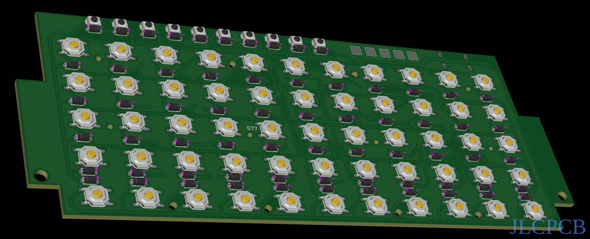

# RP2040_Keyboard
**Custom Raspberry Pi RP2040 mini keyboard for small portable projects!**


## Features
* **Microcontroller:** RP2040
* **Layout:** 5x13 Ortholinear
* **Special Features:** Integrated Left D-pad and Right Action buttons directly in the QMK matrix.
* **Firmware:** QMK

## Keymap Layout
The default keymap includes a standard typing base layer, an Fn layer with navigation and F-keys, and dedicated hardware gamepad keys mapped to the outer columns (this was made using simple buttons footprint for custom soldering, also can be replaced with functional buttons).

* **Gamepad Left:** `Up`, `Down`, `Left`, `Right`
* **Gamepad Right:** `Y`, `A`, `X`, `B`
* **Bumpers:** `Page Up` (L1), `Page Down` (R1)

## Flashing Instructions

To compile and flash this firmware, you will need the [QMK CLI](https://docs.qmk.fm/#/newbs_getting_started) installed.

1. Clone the `qmk_firmware` repository.
2. Clone or download this repository and place the `rp2040_keyboard/code/` folder into `qmk_firmware/keyboards/`.
3. Put your keyboard into bootloader mode.
4. Run the following command from the root of your `qmk_firmware` directory:

```bash
qmk flash -kb rp2040_keyboard -km default
